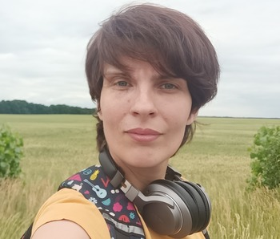

# **Maryna Hembarska**



## Contact

Phone: [+380674626984](tel:+380674626984)

Email: <marinagembarskaa@gmail.com>

Discord: Maryna (@Maryna-Hemb)

## About me

I'm a responsible person who always leads work to its full implementation. Enjoy working and want to
make beautiful and human-friendly websites. I have experience
team and individual work. Capable of learning from senior developers. I eager to tackle more complex problems and continue to find ways to maximize user efficiency. With a passion for both personal growth and for software development, I spend my time studying.

## Tech Skills

- HTML
- CSS
- SASS
- GIT
- Figma
- BEM
- JavaScript

## Code example

- ### Task

Implement the function which takes an array containing the names of people that like an item. It must return the display text as shown in the examples:

```
[] --> "no one likes this"
["Peter"] --> "Peter likes this"
["Jacob", "Alex"] --> "Jacob and Alex like this"
["Max", "John", "Mark"] --> "Max, John and Mark like this"
["Alex", "Jacob", "Mark", "Max"] --> "Alex, Jacob and 2 others like this"
Note: For 4 or more names, the number in "and 2 others" simply increases.
```

- ### Solution

```javascript
`function likes(names) {
if (names.length === 0) {
return 'no one likes this';
} else if (names.length === 1) {
return `${names} likes this`;
} else if (names.length === 2) {
return `${names[0]} and ${names[1]} like this`;
} else if (names.length === 3) {
return `${names[0]}, ${names[1]} and ${names[2]} like this`;
} else {
return `${names[0]}, ${names[1]} and ${names.length - 2} others like this`;
}
}
```

## Work experience

During studying I've made semantic markup and styling both for landing pages and homepage with inner pages. The BEM methodology (naming mainly) and SASS preprocessor were used in my projects. I have experience in responsive and liquid web design, using Mobile-first strategy and designing the pixel-perfect layout. I can work with Figma and Photoshop.

### Work examples

1. My CV: <https://Maryna-Hemb.github.io/rsschool-cv/cv>

## Education

- GoIT (EdTech company), Ukraine, Kyiv

  FullStack developer

  08.2022 - up to now

- National Technical University of Ukraine “Igor Sikorsky Kyiv
  Polytechnic Institute”, Ukraine, Kyiv

  Department of Geoengineering

  09.2004 - 05.2010

## Languages

- English: B2
